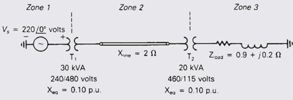
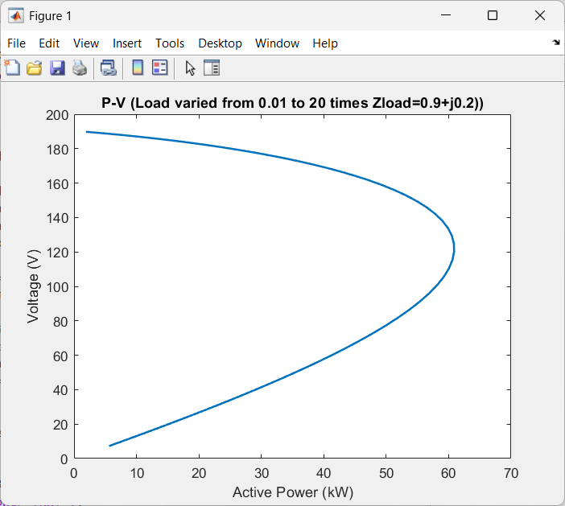
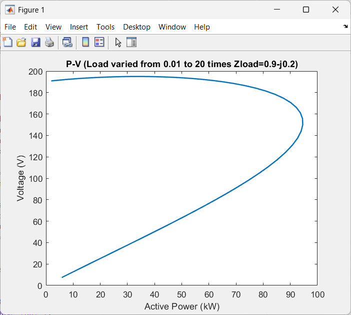

# Power System PV Curve Simulation

## 📌 Project Overview
This repository contains MATLAB/Simulink simulations for analyzing voltage stability in a three-phase power system by generating P-V curves for different load types.

## 📖 System Description
The simulated power system consists of:
- **Three-phase source:** 380 V (phase-phase), 50 Hz
- **Transformer T1:** 30 kVA, 240/480 V, Xeq=0.10 pu
- **Transmission line:** 2 Ω reactance
- **Transformer T2:** 20 kVA, 460/115 V, Xeq=0.10 pu
- **Load:** Variable impedance



## 🔬 Simulation Scenarios

### Part A: Inductive Load
- **Load impedance:** Z = 0.9 + j0.2 Ω
- **Analysis:** Load varied from 0.01× to 20× nominal value
- **Output:** P-V curve showing voltage collapse characteristics



### Part B: Capacitive Load
- **Load impedance:** Z = 0.9 - j0.2 Ω
- **Analysis:** Same load variation range as Part A
- **Output:** P-V curve demonstrating voltage improvement



## 📚 Educational Value
This project demonstrates:
- Power system modeling in Simulink
- Voltage stability analysis
- P-V curve generation
- Effects of load power factor on system performance
- Automated parameter sweep techniques

## 🛠️ Requirements
- MATLAB R2020b or newer
- Simulink
- Simscape Electrical Toolbox

## 🚀 How to Use

### For Part A (Inductive Load):
```bat
cd A
matlab_script_A
```
### For Part B (Capacitive Load):
```bat
cd B
matlab_script_B
```
